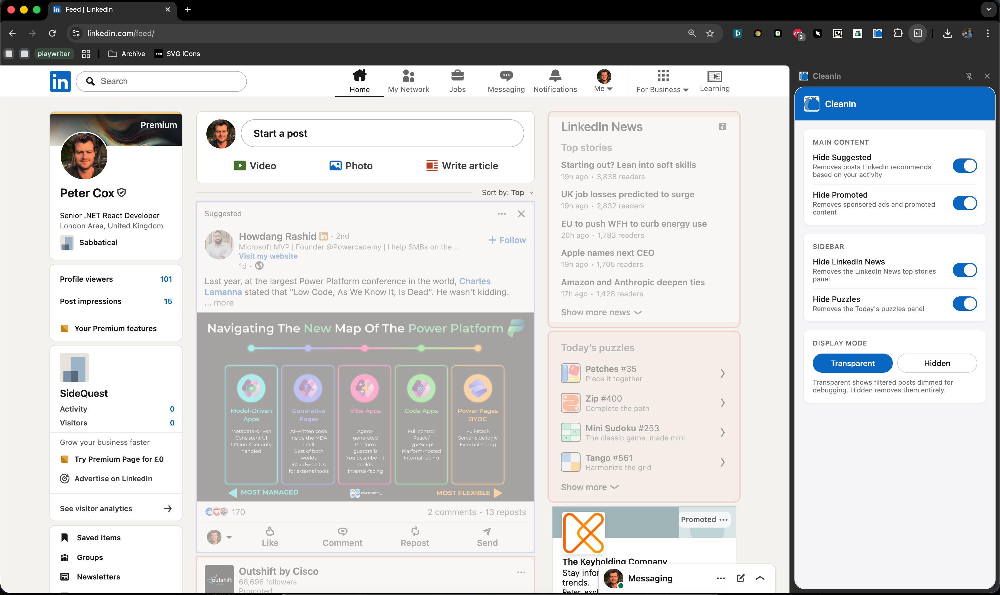

# Overview
CleanIn is a simple chrome extension that hides suggested and promoted LinkedIn feed posts you never asked to see. 

It also hides other elements such as LinkedIn News and Puzzles. 

You can display them as either transparent or totally hidden. 

## Developer instructions

1. Clone this repo.
2. Open `chrome://extensions` in Chrome.
3. Toggle **Developer mode** on (top right).
4. Click **Load unpacked** and select the [dist/](dist/) folder.
5. Visit [linkedin.com/feed](https://www.linkedin.com/feed/) and open the extension side panel to adjust filters.

## Caveats
- Only matches the English LinkedIn UI. If your LinkedIn is in French, *toutes mes excuses*.
- LinkedIn could rename "Suggested" to "Things You'll Love" tomorrow and break everything. That's the deal you sign when you scrape a SPA.
- Does not, sadly, hide posts that begin with "Unpopular opinion:".

## License
- MIT. Use it, fork it, ship a better version. Just don't promote it on LinkedIn.
